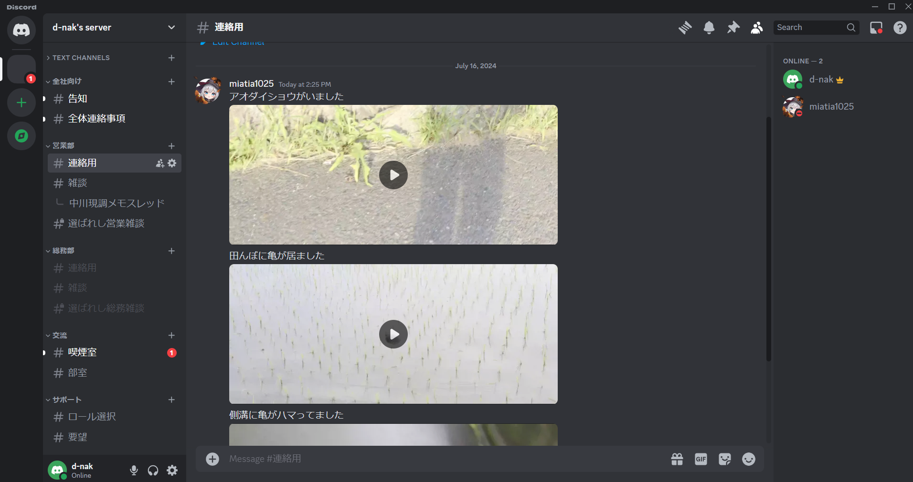
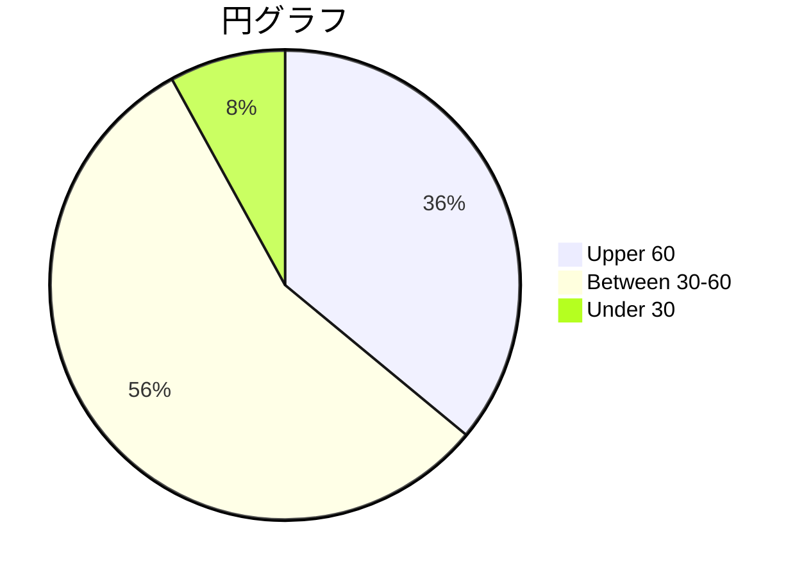
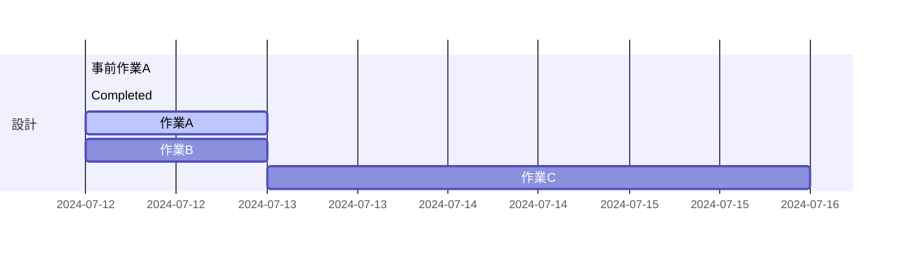
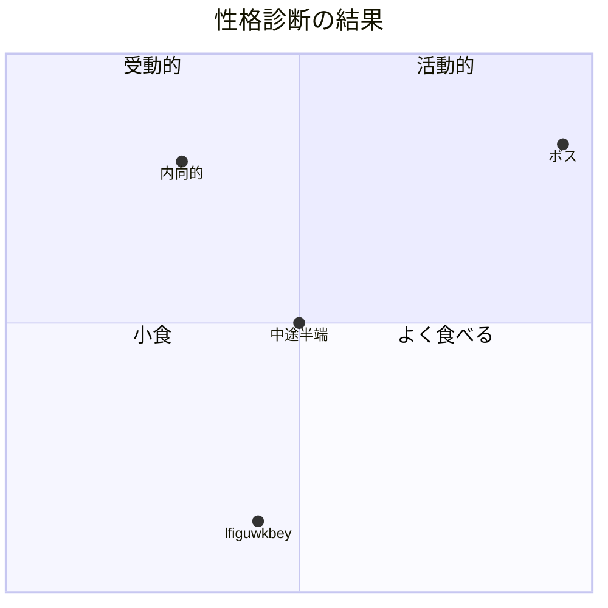
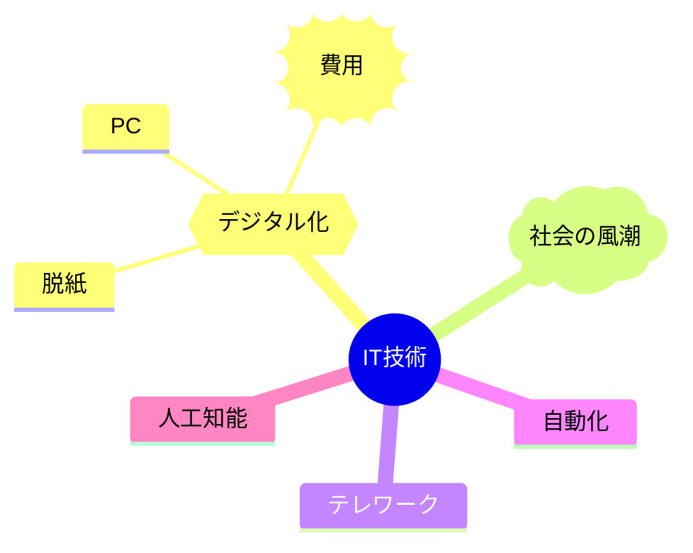
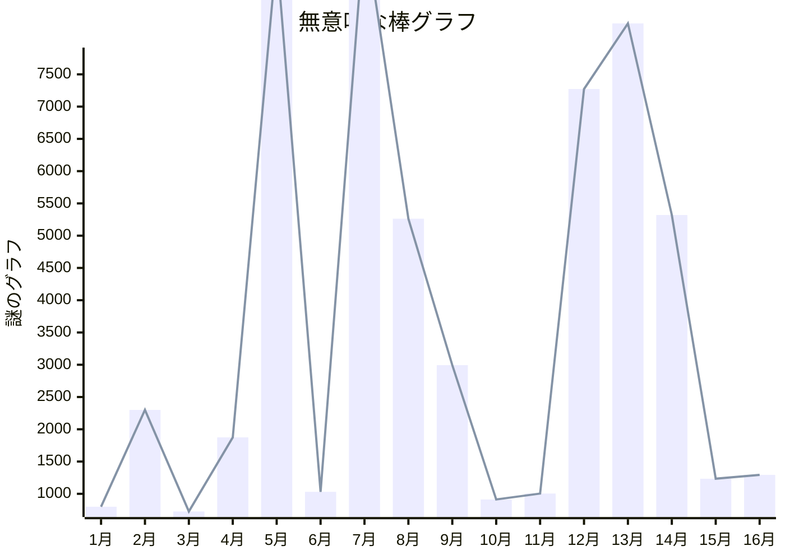

<a name="top"></a>

# Convenients って何？

便利な技術、アプリをまとめたフォルダ。
詳しい解説はそれぞれのフォルダの README.md 参照

- ソフトウェア系

  - [Discord](#discord)
  - [VSCode](#vscode)
  - [ClickUp](#clickup)

- 作法系
  - [Markdown](#markdown)
  - [Mermaid](#mermaid)

## Discord


LINE の進化版、真っ先に導入すべきはこれ。  
普通の LINE と違って、グループ一つ毎にいくらでも会話チャンネルを作ったり、ロールという概念によって特定の人にしか見ることのできない話なども可能。  
好きな画像を絵文字として登録したり、複数人参加可能なボイスチャンネルを作成したり、Bot という簡単なスクリプトの集合体になんらかの処理をさせることもできる。
コミュニティ性が高く、その分自由度が高いが、不要なチャンネルに関しては個人でミュートや非表示にできるため、情報の取捨選択ができる点も良い点。

## VSCode

高機能テキストエディタ兼、プログラムコードエディター。  
拡張機能というシステムによって、プログラムに関することはすべて対応しているといってもよい。  
とりあえず下の動画を見れば 8 割使いこなせる。  
[](https://youtu.be/Xwuhoh1UEuk)

## ClickUp

## Markdown

Markdown とは、決まった記法で記述することにより、テキストに装飾をかけられる言語。  
この説明の装飾も Markdown で書かれている

[リンクを埋め込めたり](#markdown)、  
<ins>下線</ins>・**強調**・~~取り消し線~~・*斜体*にしたり  
$\color{red}{色を付けたり、}$

<p align="right">
テキストを左右に寄せたり、
</p>

<table>
<tr>
<th>簡単な</th>
<th>表を書いたり</th>
</tr>
<tr>

<td>

| A   | B   | C   |
| --- | --- | --- |
| 1   | 2   | 3   |

</td><td>

| A   | B   | C   |
| --- | --- | --- |
| 1   | 2   | 3   |

</td></tr> </table>

<details>
  <summary>複数の要素を畳んだり</summary>

あ  
い  
う

</details>

> 引用を
>
> > 書いたり

```
ブロッククォートにしたり
```

文字の
<sup>
上下に
</sup>
ちっちゃく
<sub>
書いたり
</sub>

などいろいろな装飾を比較的手数少なく記述できる、癖はあるが慣れれば素早く見やすいメモを作成できる。
作成方法は拡張子を「.md」にして markdown で書くだけでよい。  
詳しくは Markdown フォルダ以下で

## Mermaid

Mermaid とは、決まった記法で記述することによりグラフを作成できる言語。  
円グラフや、



バーチャートとか、

```mermaid
gantt
    title バーチャート
    dateFormat X
    axisFormat %s

    section 見積もりA
    3時間:0,3
    section 見積もりB
    3時間:3,6
    section 見積もりC
    1時間:6,7
    section 見積もりD
    3時間:7,10

```



ガントチャートとか、



傾向図とか、



マインドマップとか、



棒グラフとか、



もっと複雑なものとかも可能。  
作成は「.mmd」で作成して mermaid 記法で記述するだけでよい。  
詳しくは Mermaid フォルダ以下で
