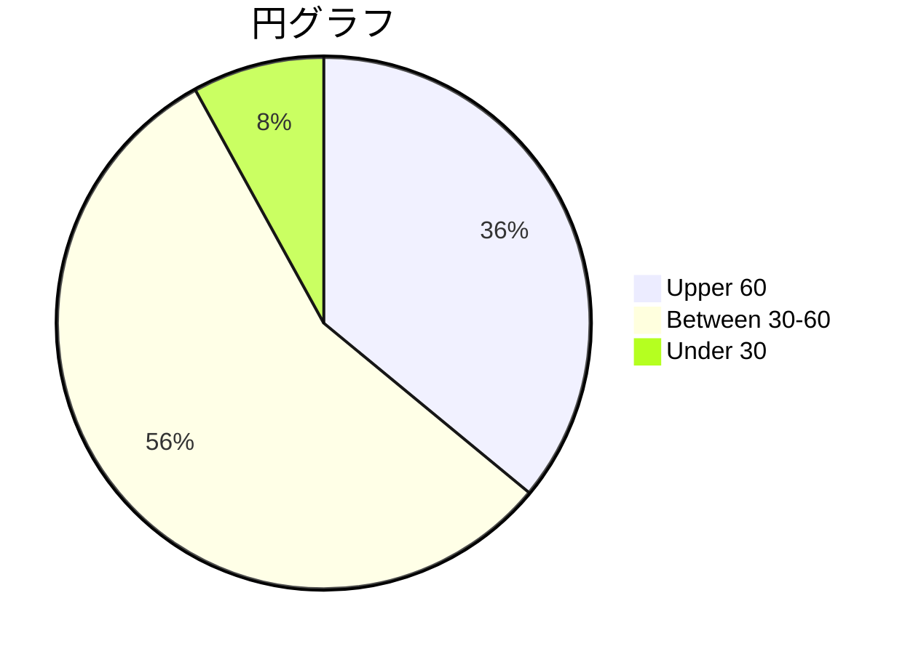
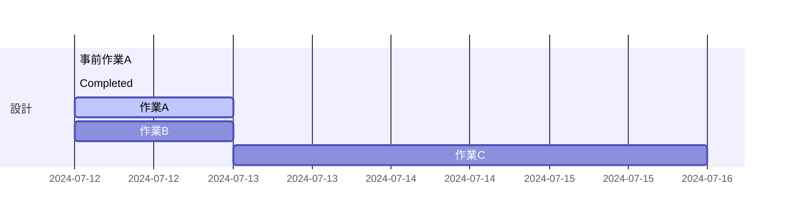

<a name="top"></a>

# Convenients って何？

便利な技術、アプリをまとめたフォルダ。
詳しい解説はそれぞれのフォルダの README.md 参照

- [Markdown](#markdown)
- [Mermaid](#mermaid)

## Markdown

Markdown とは、決まった記法で記述することにより、テキストに装飾をかけられる言語、この説明の装飾も Markdown で書かれている

[リンクを埋め込めたり](#markdown)、  
<ins>下線</ins>・**強調**・~~取り消し線~~・*斜体*であったり  
$\color{red}{色を付けたり、}$

<p align="right">
テキストを左右に寄せたり、
</p>

<table>
<tr>
<th>簡単な</th>
<th>表を書いたり</th>
</tr>
<tr>

<td>

| A   | B   | C   |
| --- | --- | --- |
| 1   | 2   | 3   |

</td><td>

| A   | B   | C   |
| --- | --- | --- |
| 1   | 2   | 3   |

</td></tr> </table>

<details>
  <summary>複数の要素を畳んだり</summary>

- <kbd>あ</kbd>
- <kbd>い</kbd>
- <kbd>う</kbd>

</details>

> 引用を
>
> > 書いたり

```
ブロッククォートにしたり
```

文字の
<sup>
上下に
</sup>
ちっちゃく
<sub>
書いたり
</sub>

などいろいろな装飾を比較的手数少なく記述できる、癖はあるが慣れれば素早く見やすいメモを作成できる。
作成方法は拡張子を「.md」にして markdown で書くだけでよい。

## Mermaid

Mermaid とは、決まった記法で記述することによりグラフを作成できる言語。
いろいろグラフを作れるが、  
円グラフや、



バーチャートとか、

```mermaid
gantt
    title バーチャート
    dateFormat X
    axisFormat %s

    section 見積もりA
    3時間:0,3
    section 見積もりB
    3時間:3,6
    section 見積もりC
    1時間:6,7
    section 見積もりD
    3時間:7,10

```



ガントチャートとか、



もっと複雑なものとかも可能。
作成は
